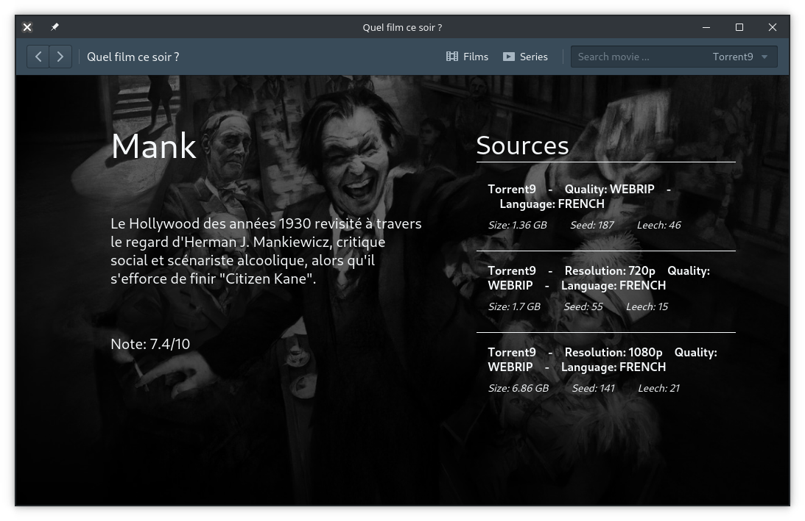

# Quel film ce soir ?

A small application with a backend, a desktop frontend and an android app to help you download your next movie tonight.

## Installation

### Backend

The backend is made using NodeJS, Apollo, Cheerio, GraphQL and more.

In order to install the projet all you need is to `cd` in the backend folder then :

```bash
yarn # install all dependencies
# or 
npm install
```

Then either you use the dev. server or you can build the project and serve the result :

```bash
yarn dev
# or
yarn build && yarn start
```

Just wait a few moments and you should have the backend server up and running!


### Desktop application

The desktop app is made using ReactJS and ElectronJS (with Apollo, GraphQL, blueprintJS and way more libs).

In order to run the dev version of the app just `cd` into the folder and :

```bash
yarn # install all dependencies
yarn electron:dev # launch the dev version
```

If the backend is running you should have something like this :




## Android application

Build using React Native, Expo and KittenUI. To run the app it is a bit tricky.

First install the Expo app on your smartphone (Android or iOS) and then `cd` in the mobile folder then :

```bash
yarn # install all depedencies
yarn start
```

You should be presented with a QR code that you have to scan using the Expo app and you sould be able to see something like this :


